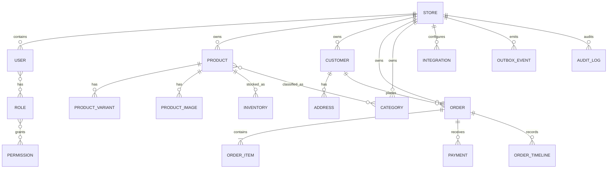

# ERD — núcleo transacional

```mermaid
erDiagram
  STORE ||--o{ USER : contains
  STORE ||--o{ PRODUCT : owns
  STORE ||--o{ CUSTOMER : owns
  STORE ||--o{ ORDER : owns
  STORE ||--o{ CATEGORY : owns
  USER }o--o{ ROLE : has
  ROLE }o--o{ PERMISSION : grants
  PRODUCT ||--o{ PRODUCT_VARIANT : has
  PRODUCT ||--o{ PRODUCT_IMAGE : has
  PRODUCT ||--o{ INVENTORY : stocked_as
  PRODUCT }o--o{ CATEGORY : classified_as
  CUSTOMER ||--o{ ADDRESS : has
  CUSTOMER ||--o{ ORDER : places
  ORDER ||--|{ ORDER_ITEM : contains
  ORDER ||--o{ PAYMENT : receives
  ORDER ||--o{ ORDER_TIMELINE : records
  STORE ||--o{ INTEGRATION : configures
  STORE ||--o{ OUTBOX_EVENT : emits
  STORE ||--o{ AUDIT_LOG : audits
```

O schema Prisma é a fonte executável deste diagrama. Valores financeiros usam `Decimal(14,2)`, nunca `float`; PII identificável tem campos dedicados para criptografia.
